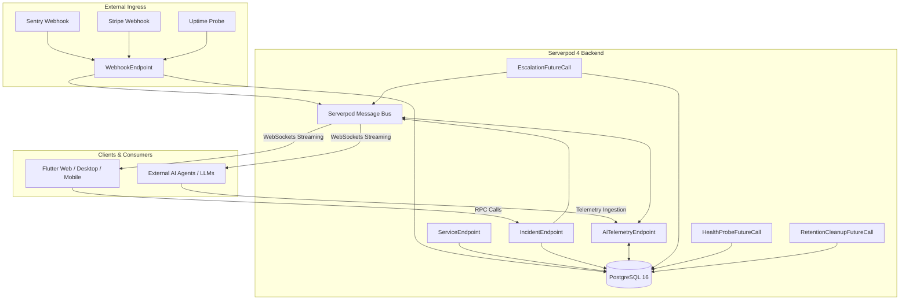

# 🏛️ IncidentPulse Architecture & Developer Specification

## 1. System Overview

IncidentPulse is a real-time incident commander, webhook ingestion gateway, and collaborative triage war room built for indie developers, solo SaaS founders, agile teams, and autonomous AI agents.

---

## 2. Serverpod 4 Feature Exploitation

| Serverpod Superpower | Implementation in IncidentPulse |
| :--- | :--- |
| **Streaming & WebSockets** | `WarRoomEndpoint`: Realtime bidirectional event bus streaming updates directly to Flutter clients without polling. |
| **Future Calls (Worker Queue)** | `EscalationFutureCall`: Background delayed execution checking unacknowledged high-severity incidents after 5 minutes. |
| **Scheduled Maintenance** | `RetentionCleanupFutureCall`: Automated daily compliance job purging expired raw payloads per tenant data retention windows. |
| **PostgreSQL Relational ORM** | `.spy.yaml` schemas with foreign key relationships (`Service` -> `Incident` -> `IncidentEvent`). |
| **Serverpod Insights** | Built-in health diagnostic server running on port `8082` for deep telemetry and query profiling. |
| **Zero-Configuration Deployment** | Compatible with Serverpod Cloud, Fly.io, Railway, and local Docker Compose. |

---

## 3. Data Models (`.spy.yaml`)

### `Service`
- `id`: Auto-increment integer ID
- `name`: Human-readable service name (e.g. *They Might Byte*, *Billing API*)
- `slug`: URL-friendly identifier
- `webhookKey`: Secret authentication token for webhook ingress
- `pingUrl`: Optional HTTP target for synthetic health probes
- `status`: Current status (`operational`, `degraded`, `down`, `maintenance`)
- `checkIntervalSeconds`: Frequency of synthetic checks
- `isInternalOwner`: Internal project vs client tenant flag
- `enableAiBridge`: Opt-in flag for AI telemetry integration (default: `false`)
- `dataRetentionDays`: Retention duration in days (30, 90, 180, 365)
- `redactPii`: PII scrubbing toggle

### `Incident`
- `id`: Auto-increment integer ID
- `serviceId`: Foreign key to `Service`
- `title`: Alert headline
- `description`: Detailed error summary, stack trace, or webhook payload
- `severity`: Priority level (`low`, `medium`, `high`, `critical`)
- `status`: Lifecycle phase (`triggered`, `acknowledged`, `investigating`, `resolved`)
- `source`: Alert origin (`sentry`, `stripe`, `uptime`, `github`, `manual`)
- `rootCause`: Post-mortem root cause summary
- `rawPayload`: Raw webhook payload (purged upon retention expiration)
- `isRedacted`: Redaction state flag
- `expiresAt`: Compliance expiration timestamp
- `triggeredAt`, `acknowledgedAt`, `resolvedAt`: Timestamps

### `IncidentEvent`
- `id`: Auto-increment integer ID
- `incidentId`: Foreign key to `Incident`
- `author`: Sender label (e.g. *On-Call Engineer*, *AI Assistant*, *Webhook*)
- `eventType`: Classification (`status_change`, `note`, `alert`, `ai_insight`)
- `content`: Markdown text, stack trace, or remediation diff
- `isRedacted`: Redaction state flag
- `createdAt`: Timestamp

### `ReliabilityReport`
- `serviceId`: Foreign key to `Service`
- `uptimePercent`, `incidentCount`, `mttrMinutes`, `healthScore`: Historical benchmarks
- `reportSummary`: Executive summary
- `generatedAt`: Timestamp

---

## 4. Pluggable AI Telemetry Bridge Protocol

IncidentPulse features an open, pluggable interface for AI agents, diagnostic bots, and LLMs (`AiTelemetryEndpoint`):

1. **Telemetry Summary (`getTelemetrySummary`)**:
   - External agents or bots invoke this endpoint to retrieve MTTR, active incident counts, and system status for opted-in services.
2. **Autonomous AI Diagnosis (`submitAiDiagnosis`)**:
   - When a critical incident triggers, an authorized agent can submit diagnostic hypotheses and unified diff suggestions directly into the War Room.
3. **Preshared Secret Protection**:
   - Authenticated via the `AI_TELEMETRY_BRIDGE_KEY` environment variable.

---

## 5. Tenant Data Privacy & Compliance Architecture (GDPR / CCPA / SOC2)

### A. Strict Tenant Isolation & Opt-In Policy
- Services are marked with `enableAiBridge` (strictly **false by default** for customer tenants).
- `AiTelemetryEndpoint` queries enforce `isInternalOwner == true | enableAiBridge == true`. Customer data that has not opted in is inaccessible to external AI assistants.

### B. Configurable Data Retention Windows
- Tenants select a retention policy: **30 Days (Strict GDPR)**, **90 Days (Standard)**, **180 Days**, or **365 Days (SOC2 Audit)**.
- **`RetentionCleanupFutureCall`**: Daily background worker. When an incident passes `expiresAt`, raw request bodies, webhook parameters, and sensitive details are permanently scrubbed, leaving incident metadata, MTTR metrics, and post-mortem notes intact for historical review.

### C. Automatic PII & Secret Redaction
- Webhook ingress scrubs authorization bearer tokens, API secrets (`whsec_`, `sk_live_`), customer email addresses, and credit card patterns prior to writing to the database.

### D. Right to Erasure (GDPR Article 17)
- `ServiceEndpoint.purgeServiceHistory(serviceId)` provides instant compliance deletion of all raw payloads or complete incident records upon customer request.
